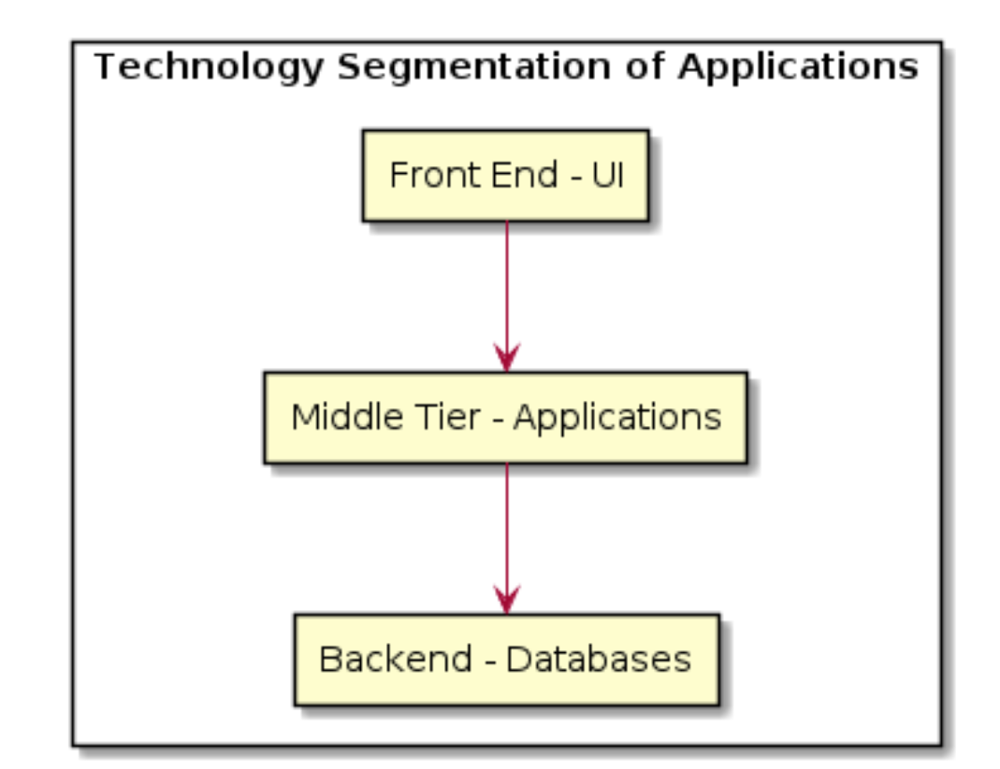
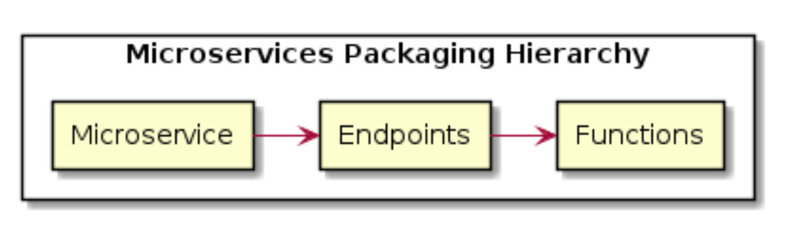

# Microservices - A Decision Pathway

## Background

Microservices emerged as a variant to `Service Oriented Architecture` to arrange applications within an organization as loosely coupled services. It first emerged more as a IT operation approach than as a technology approach. The driver for the operational approach was to move way from technology segmentation of applications to more of an end-to-end business segmentation of applications

## Technogy Segmentation of Applications

Before the advent of micro-services, it was common to treat IT division as a separate entity. All other divisions would approach the IT division for their IT and application needs.  It was very common to find enterprise technology teams split horizontally along the lines shown below in this diagram. 

Most often the products and solutions of each of these divisions would be run together as a large `Monolith`. A very good example is `Enterprise Resource Planning (ERP)` applications, where solutions related to Sales, Manufacturing, Finance and HR are run as a single application

## Business and Domain Segmentation of Applications

Organizations needed a different organizational and architectural approach to address this **joined-at-hip** problem. `Service-Oriented-Architecture` was touted as a solution but it too suffered from the same problem - it was centralized and controlled by IT divisions (in addition to host of other problems, which this article would not cover)

`Microservices` is the second coming of `SOA` but in a different avatar. This time the teams would be divided by business domains, giving each business domain complete control of its IT estate right from requirements to deployment. Also this control was not necessarily at a division level but at much more granular service level as identified by the `Bounded Context`

A very good example is the much familiar case of Amazon shopping website. Amazon probably runs the following different microservices (and much more)
1. Order Service
2. Shipping Service
3. Recommendation Service
4. Product Catalog Service
5. Shopping Cart Service

## Characteristics of a Microservice application

| # | Feature | Description   |
|---|---------| --------------------------------------------|
| 1 | Autonomous and Focussed towards an independent business need | Order Service and Shipping Service are independent services that probably have a different business sponsor  |
| 2 | Flexible and Independent Scaling  | Order Service could be servicing 1Million requests while Shipping Service is working on 10,000 request at any given time      |
| 3 | Independent Resilience   | When Order Service goes down, Shipping service could be still up and runing |
| 4 | Independent Technology Choice   | Order service could be written in Python and Shipping service written on NodeJs  |
| 5 | Isolated Data Store  | Order service and Shipping service probably are operating on independent/isolated databases. One could be using a relational database, another a no sql database. Each service masters data belonging to its own domain |
| 6 | Distributed Transactions  | Patterns such as `Saga` are used to ensure the Isolated Data Stores are aligned  |

## To Microservice or Not?

One of the challenges with teams considering Micro-services is how to group up functionalities into micro-service. In reality, **_every application in itself is a service_**. We can answer the above question using the following framework.

| # | Evaluation Criteria  |
|---|----------------------|
| 1 | Are there distinct business boundaries between each of these functionalities?  |
| 2 | Would there be a separate support team catering to the upkeep of these services? | 
| 3 | Do each of these services have a different product owner?  | 
| 4 | Do each of these services have a separate isolated data store that they own and use?| 
| 5 | Is there a need to deploy these services independent of one another without breaking the functionality of the other  | 
| 6 | Can these services scale independently?  | 
| 7 | Is there a business case for keeping a partial list of services working? Would it be ok for 2 of the 4 services to go down and still our business case would be met? | 

## Microservices Packaging Hierarchy

* At the micro-service level, a deployment, an API contract, and an API versioning system is required. 
* End-points are the different methods (such as REST) on resources the microservice caters to such as: get, put, delete records belonging to resources
* Functions are hidden away code that dev teams use to modularize the development

Moving modularity from right to left increases complexity along the development, deployment and maintainability axis. AS in, a team can decide to convert each of its functions to microservice, increasing the deployment complexity to maximum possible. Or, the entire application is deployed as a single service, keeping the deployment complexity minimum. The recommended approach is to keep the micro-service level at absolute minimum and start opening it up based on business cases.

## How to package the functionalities for deployment?

Often times literature treats the packaging of the functionalities as `Microservice`. As we have seen above the concept of `Microservice` is a framework that enables business agility through granular services. The packaging of applications and domain boundaries are two different concepts.

The broad options for packaging functionalities are as follows along with their pros and cons

| # | Packaging Choice | Description| Pros| Cons  |
|---|------------------|------------|-----|-------|
| 1 | Monolith - Single threaded | All functionalities run under a single thread making synchronous calls to each other | Easy to maintain| * Scope for performance improvement|
| 2 | Monolith - Multi threaded| Functionalities make asynchronous calls to one another | * Improves performance | * Difficult to maintain and debug   * `Amdahl's Law` will come into play giving only a marginal gain |
| 3 | Monoliths (Single or Multiple threaded)   but with public end points for all functionalities | External clients have access to all the functionalities through REST endpoints       | Helps in debugging individual functionalities |  * Clients and Testers could trigger unwanted behaviour by directly invoking the hidden functionality   * Clients don't require the individual functionality   * If there is problem in individual functionality, testers can easily trap it in the public functionality |
| 4 | Individual container for each of the functionalities | In addition to the above, the package is deployed in individual containers | Caters to micro-service based domain requirements and isolation | * All cons above +  * Bloated image size. All functionalities in a single container is around 380 MB. For the six services we are looking at roughly ~2GB, increasing cloud costs  * Increased deployment load   * Reduced performance, as now calls are completed over HTTP rather than the thread space  * Increased versioning load as now API contracts have to be maintained for multiple services instead of 1 |

**Note**
* Ideally, the 4th option would kick in for every functionality identified if it starts exhbiting any of the features of Microservice

## Services and Packaging Combinations

Given the above deployment options, broadly following combinations are possible

|Combination | Description| 
|------------|------------|
|Uni-service and Monolith | An application where all the functionalities all deemed to exist within one Bounded Context and deployed within a single container |
|Multi-service and Monolith | In Amazon's example above, each of the service described above could be deployed as a monolith within the service |
|Uni-service and Multi-containers| An application deemed to be a Uni-service could still use multiple services if some of the funcationalities can scale independently |
|Multi-service and Multi-containers| Multiple micro-services, with each deciding to distribute their functionalities across multiple containers|

## References
1. [What is a Microservice](https://aws.amazon.com/microservices/)
1. [Domain Driven Design and Bounded Context](https://martinfowler.com/bliki/BoundedContext.html)
1. [Microservices Data Patterns](https://microservices.io/microservices/news/2017/07/24/revised-data-patterns.html)
1. [Amdahl's Law - Limits to Parallelism](http://tutorials.jenkov.com/java-concurrency/amdahls-law.html)